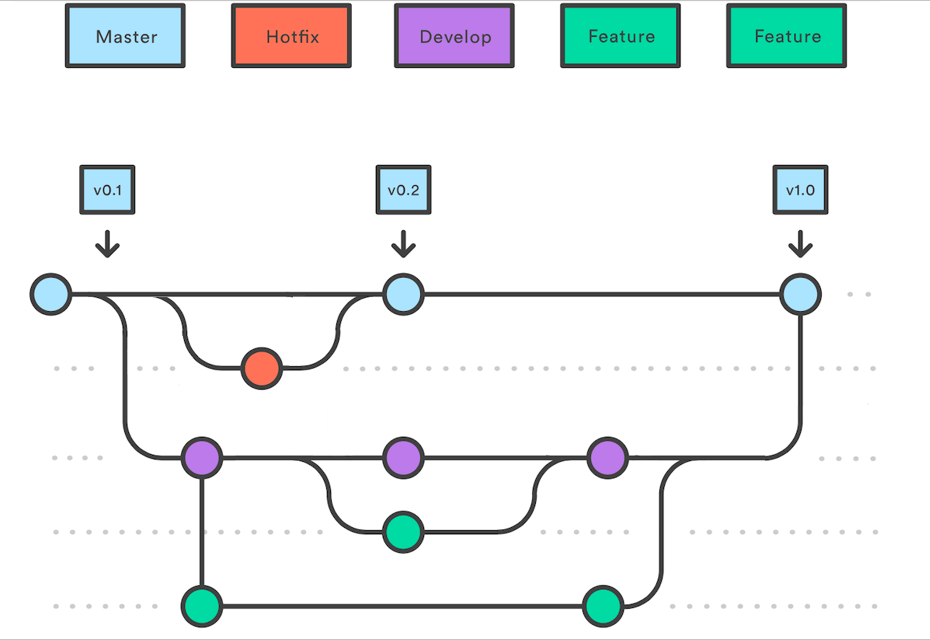

  <h1> 
    
 
      Lab Assignment 1
    

  </h1>
  
[//]: # (Markdown badges for GitHub & GitHub Desktop)
  
 
    
    
      
  

[//]: # (Assignment description)
  
 
  ──── .✦ ⚗️ ✦. ────   
  This lab was for DIG4714 (Intermediate Game Development)   and it was a practice in committing, merging, and creating multiple branches   with different origins.   
  Our goal for this assignment was to recreate the following graph: 
      
       
      
  During this assignment, I had to revert to a previous commit   since I had messed up the flow of the activity;   before making the "feature 1" branch, I had already made the   second develop commit.   
  Because of this, I had to revert to when I first created the branch.   I learned how to use <b>git reset</b> by doing this though, so it was a valuable experience!
      
  ──── .✦ ⚗️ ✦. ────
  

